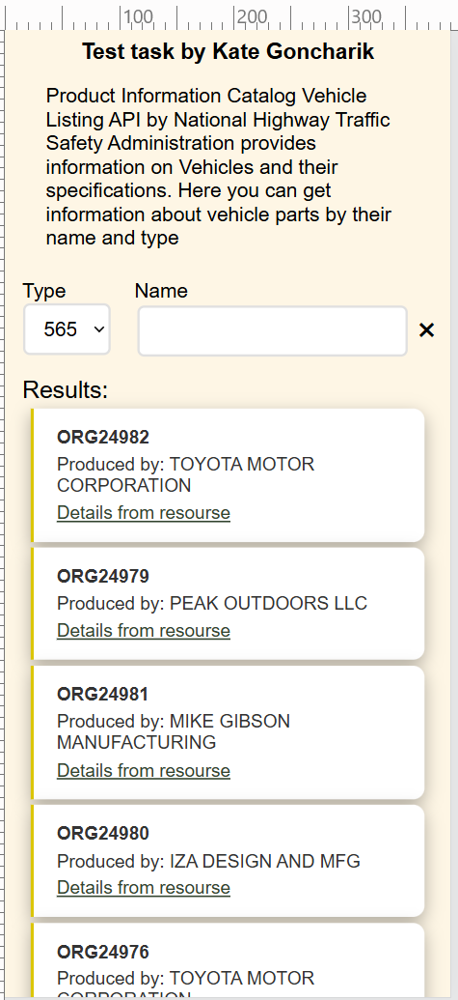

<!-- PROJECT LOGO -->
 

  
  <h1 align="center">Search and filter</h1>

<!-- TABLE OF CONTENTS -->

  
Table of Contents

  <ol>
    <li>
      <a href="#about-the-project">About The Project</a>
      <ul>
        <li><a href="#technology-stack">Technology stack</a></li>
      </ul>
    </li>
    <li>
      <a href="#getting-started">Getting Started</a>
      <ul>
       <li><a href="#installation">Installation</a></li>
      </ul>
    </li>
  </ol>

<!-- ABOUT THE PROJECT -->

## About The Project

### _Test project_

_Completed: November 2025_

#### Search and filter

Task:

Разработать веб-приложение для поиска автозапчастей (Parts) по названию, с отображением
информации о производителе (Manufacturer).

Функционал:

1. Поиск запчастей
   - Поле ввода для поиска по названию (Name).
   - Запрос к API NHTSA: пример
     <https://vpic.nhtsa.dot.gov/api/vehicles/GetParts?name=ORG10655&format=json>
     o Отображение результатов в виде списка (таблица или карточки).
1. Информация о производителе
   - Для каждой найденной запчасти выводить:
   - Название производителя (ManufacturerName).
   - Ссылку на детализацию (URL).
   - При клике на производителя — запрос дополнительных данных:
     <https://vpic.nhtsa.dot.gov/api/vehicles/getmanufacturerdetails/24109?format=json>
   - Отобразить:
     - Адрес, контакты, страну.
     - Тип производителя (ManufacturerTypes).
1. Дополнительно (по желанию)
   o Фильтрация по типу запчасти (Type из ответа API).
   o Пагинация (если результатов много).

### API

[NHTSA VPIC API](https://vpic.nhtsa.dot.gov/api/)

### Required technologies

- TypeScript / React (or JS)
- Fetch/Axios
- HTML/CSS (or SCSS/Tailwind/Bootstrap).

### Technology stack

- [![NPM][NPM]][NPM-url]
- [![HTML5][HTML5]][HTML5-url]
- [![TypeScript][TypeScript]][TypeScript-url]

(<a href="#readme-top">back to top</a>)

<!-- GETTING STARTED -->

## Getting Started

Please, follow these steps to run project.

### Installation

1. Clone the repo

   sh
   git clone <https://github.com/KateGoncharik/search-and-filter-test-task.git>

2. Install NPM packages

   sh
   npm install

3. Start project

   sh
   npm run dev

(<a href="#readme-top">back to top</a>)

[NPM]: https://img.shields.io/badge/NPM-%23CB3837.svg?style=for-the-badge&logo=npm&logoColor=white
[NPM-url]: https://www.npmjs.com
[HTML5]: https://img.shields.io/badge/html5-%23E34F26.svg?style=for-the-badge&logo=html5&logoColor=white
[HTML5-url]: https://html.com/html5/
[TypeScript]: https://img.shields.io/badge/typescript-%23007ACC.svg?style=for-the-badge&logo=typescript&logoColor=white
[TypeScript-url]: https://www.typescriptlang.org
